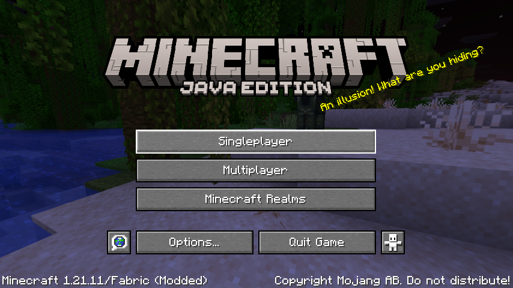
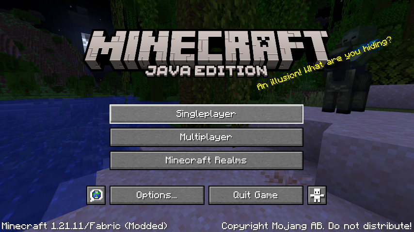

<div align="center">



# OpenDqrkis

**Sicherheitsgeprüfter, vollständig deobfuszierter und netzwerkfreier Quellcode-Release
des Minecraft-Clients *Dqrkis* (Fabric, Minecraft 1.21.11, Java 21)**

[](https://github.com/fakten60-svg/OpenDqrkis/actions/workflows/gradle.yml)
[](https://github.com/fakten60-svg/OpenDqrkis/releases)
[](https://www.minecraft.net)
[](https://fabricmc.net/)
[](https://adoptium.net)
[](AUDIT_REPORT.md)
[](#-nachweis-der-client-ist-offline)
[](LICENSE)

</div>

---

> [!WARNING]
> **Das ist ein Cheat-Client.** Er verstößt gegen die Nutzungsbedingungen so gut wie aller Server
> und kann zu Bans führen. Dieses Repository existiert zu **Forschungs- und Sicherheitszwecken** —
> es dokumentiert, welche Schadcode-Komponenten im Original enthalten waren und wie sie entfernt
> wurden.

## 📋 Über das Projekt

*Dqrkis* ist ein Minecraft-Cheat-Client für **Fabric 1.21.11**. Das Original wurde offenbar
kommerziell vertrieben und war obfuskiert. Dieses Repository enthält eine entpackte,
nachvollziehbare Java-Quellcode-Version, aus der **alle Schadcode-Fähigkeiten entfernt** wurden.

| | |
|---|---|
| **Quellcode** | 180 Java-Dateien, ~17.300 Zeilen |
| **Module** | 70 (Combat / Misc / Render / Cart / Client) |
| **Mixins** | 28 (abgeglichen mit `client.mixins.json`) |
| **Konfiguration** | lokal: `.minecraft/config/dqrkis.json` |
| **Netzwerk** | **keine** Referenzen im gesamten Quellcode & Artefakt |
| **Prüfbericht** | [AUDIT_REPORT.md](AUDIT_REPORT.md) — 5 Audit-Pässe |

> [!NOTE]
> **Ehrliche Einordnung:** Dieser Baum ist ein **Teil-Port mit Stubs**, *keine* vollständige
> Dekompilierung. An elf Stellen wurde Original-Logik durch Platzhalter ersetzt
> (`BlockSelectorBox`, `EnchantSelectorBox`, `HudEditorScreen`, `ItemSettingBox`,
> `DqrkisClickGui`, `AutoShulker`). Die dort referenzierten obfuskierten Original-Klassen
> (`Class768`, `Class1224`, `Class1619`, `Class1736`, `Class1916`) liegen **nicht** im Repository
> und sind damit **nicht überprüfbar**. Die Aussagen dieses Audits gelten deshalb für **genau
> dieses Release** — nicht für andere Builds oder Distributionen des Clients.

## 📸 Screenshots

| Titelbildschirm (geprüfter Build) | ClickGUI (Rechte-Shift) |
|---|---|
|  |  |

Beide Aufnahmen stammen aus dem **geprüften Release-Build** (F2-Screenshot-Funktion des Spiels im
headless-Xvfb-Lauf, Skript [`scripts/capture-client-load.sh`](scripts/capture-client-load.sh)) —
sie dokumentieren zugleich, dass der Client fehlerfrei startet und rendert.

---

## 🔒 Sicherheitsaudit — 5 Pässe, alle Befunde entschärft

Der vollständige Bericht mit Fundtabelle, Methodik und jedem Einzelnachweis steht in
**[AUDIT_REPORT.md](AUDIT_REPORT.md)**. Kurzfassung der Entschärfungen:

### Entfernte Malware-Fähigkeiten

| Kategorie | Was entfernt wurde |
|---|---|
| **Datenabfluss** | `utils/DiscordWebhook.java` (generischer HTTP-POST-Client für Text + **beliebige lokale Dateien**) komplett gelöscht; Webhook-Leak inkl. Discord-`@`-Ping aus `SpawnerProtect`; Screenshot-Upload samt Koordinaten aus `SilentHomeSetter`; Auction-API-Modus mit `Authorization: Bearer <apiKey>` aus `AuctionSniper` |
| **Remote Code Execution** | `Utils.replaceModFile()` / `Utils.doDestruct()` — luden eine JAR von einer **benutzereditierbaren URL** und überschrieben die laufende Mod-Datei |
| **Anti-Forensik** | `Dqrkis.setLastModified()` / `resetModifiedDate()` — zurücksetzen des Änderungszeitpunkts der eigenen JAR |
| **Identitätstäuschung** | `fabric.mod.json` gab sich als die legitime Mod *ImmediatelyFast* aus (fremde Links, LGPL, fremder Icon-Pfad, Discord-Invite) — **alle Metadaten jetzt ehrlich** |
| **Versteckte Sonderlogik** | unsichtbarer `"venom"`-Spieler-Bypass in `SpawnerProtect` (nicht in der GUI sichtbar) |
| **Versteckte Persistenz** | Konfiguration lag in zufällig benanntem Temp-Ordner (`UJHfsGGjbPfVZ`) bzw. `$HOME` — jetzt ausschließlich `.minecraft/config/dqrkis.json` |
| **Build-Probleme** | nicht existierende `lib/annotations-1.0.6.jar` ersetzt; nicht deklarierter JNA-Import entfernt; leere `shadow`-Konfiguration (JAR-Einbettung fremder JARs) entfernt |

### Modul-Entfernung & Entobfuskation (Pass 3)

Auf ausdrückliche Anforderung wurden **vier Module komplett entfernt** (Datei + Registrierung +
jede Referenz): **`SelfDestruct`** (destruktiver Panik-Wipe), **`AuctionSniper`**,
**`SilentHomeSetter`**, **`SpawnerDropper`**. Zusätzlich wurde der Verschleierungs-Helper
**`EncryptedString`** (XOR-Strings, 692 Aufrufstellen in 80 Dateien) vollständig entfernt —
alle Strings stehen jetzt im Klartext. **74 → 70 Module**; eine alte `dqrkis.json` muss einmal
neu angelegt werden (Config wird per Listenindex gespeichert).

### Nachprüfungen in Pass 4 & 5

- **Modul-Selbsttest (Pass 4):** alle 70 Module einzeln durch Enable/Disable-Rundlauf geschaltet:
  `total=70 ok=69 selfdis=1 fail=0` — **keine Ausnahme**; der eine `selfdis`-Fall (`Auto Sell`)
  ist designbedingt (Einmal-Aktionsmodul deaktiviert sich ohne Welt/Spieler selbst).
- **Vollständiger Fünf-Pass-Re-Review (Pass 5):** alle 180 Java-Dateien erneut geprüft
  (Netzwerk, Exec, dynamisches Klassenladen, Reflection, Natives, Base64/Cipher,
  System-/Umgebungsabfrage, Clipboard, versteckte Commands, UUID-Sonderfälle, Thread-Timer,
  Build-Dateien, CI-Workflow, alle Ressourcen). **Ein Verbesserungsbefund:** der mitgelieferte
  `gradle-wrapper.jar` war ein älteres 8.x-Binary — durch den **byte-kanonischen Wrapper der
  Gradle-9.2.1-Distribution** ersetzt (`423cb469…`). Darüber hinaus **0 Befunde**.

### Was NICHT geändert wurde

- **Die Cheat-Funktionen selbst** (Aimbot, AutoCrystal, ESP, AutoReconnect, Ping-Spoof …).
  Die Entschärfung entfernt Malware-Fähigkeiten, nicht das Cheating — eine bewusste Entscheidung.
- `Module implements Serializable` (markiert, ohne Serialisierungspfad — dokumentierte Hygiene-Notiz).

---

## ✅ Verifikation

| Prüfung | Ergebnis |
|---|---|
| `./gradlew build` (JDK 21, Gradle 9.2.1) | **BUILD SUCCESSFUL**, 0 Fehler, 0 Mixin-/Remap-Warnungen |
| Realer Start (headless, Xvfb, `runClient`) | Mod geladen, **Titelbildschirm gerendert** (OCR-Nachweis), **0 Mixin-Fehler, 0 Crash-Reports** |
| Modul-Selbsttest (Pass 4) | **70/70 Module ohne Ausnahme** (69 ok, 1 designbedingte Selbstdeaktivierung) |
| Bytecode-Scan der JAR | **0 Treffer** auf URLs, `java/net`, `HttpClient`, `Socket`, `WebSocket`, `ProcessBuilder`, `ClassLoader`/`defineClass`, `System.load`, `Base64`, `discord`/`webhook`/`telegram`, `Bearer`/`apiKey`/`Authorization`, `Robot` … |
| Quellcode-Sweeps (Pass 5) | **0 Treffer** in allen 16 Schadcode-Kategorien über 180 Dateien |
| `gradle-wrapper.jar` | byte-identisch mit dem Wrapper der offiziellen **Gradle 9.2.1**-Distribution |
| CI (`Build Mod`) | **grün** bei jedem Push (JDK 21, `ubuntu-latest`, nur GitHub-Actions) |
| Artefakt | `dqrkis-b1.1.jar`, 506.220 Bytes, SHA-256 `7501719d056c1d8134212312fce28b6bc550299374e29dbab416c4a69599d430` |

### 🔌 Nachweis: Der Client ist offline

```bash
grep -rn "java\.net\.|HttpURLConnection|HttpClient|openConnection|Socket|WebSocket|Webhook" src/   # 0 Treffer
grep -rnoE "https?://[^\" ]+" src/                                                                  # 0 Treffer
```

Es existiert **keine** Netzwerk-API und **keine** URL. Der Client kommuniziert nur über die
normale Minecraft-Protokollschicht mit dem Server, zu dem der Nutzer sich verbindet. Auch: keine
`ProcessBuilder`/`Runtime.exec`, kein dynamisches Klassenladen, kein `System.load`, keine
Base64-/Cipher-Nutzung, keine Registry-/Autostart-Manipulation, kein Schreibzugriff außerhalb
des Spielordners.

### 🚀 Nachweis: Der Client startet fehlerfrei

```
[main/INFO] (FabricLoader) Loading 51 mods:
	- dqrkis 1.2.11+1.21.11
[main/INFO] (FabricLoader/Mixin) Compatibility level set to JAVA_21
[Render thread/INFO] (Minecraft) Setting user: Player789
[Render thread/INFO] (Minecraft) Reloading ResourceManager: vanilla, dqrkis, fabric, …
```

0 Mixin-Warnungen/Fehler, keine Crash-Reports; gerendertes Hauptmenü per OCR bestätigt
(`Minecraft 1.21.11/Fabric (Modded)`, `Singleplayer`, `Multiplayer`, `Minecraft Realms`, …).
Verbleibende Log-Fehler (`401`-Offline-Auth, Realms-Auth, fehlendes `libflite`, kein OpenAL-Gerät)
sind reine Container-Artefakte und treten auch ohne diese Mod auf.

---

## 📦 Release laden (empfohlen)

Den fertigen, geprüften Build gibt es unter
[**Releases → v1.2.11-audited**](https://github.com/fakten60-svg/OpenDqrkis/releases/tag/v1.2.11-audited):

```
dqrkis-b1.1.jar          SHA-256: 7501719d056c1d8134212312fce28b6bc550299374e29dbab416c4a69599d430
dqrkis-b1.1-sources.jar
```

Die Prüfsumme ist im
[Audit-Report (§10.3)](AUDIT_REPORT.md) dokumentiert — vergleiche sie nach dem Download
(`sha256sum dqrkis-b1.1.jar`).

## 🛠️ Selbst bauen

**Voraussetzungen:** **JDK 21** (z. B. Eclipse Temurin) · Internetzugang beim ersten Build
(Gradle lädt Fabric Loom, Minecraft und Mappings)

```bash
git clone https://github.com/fakten60-svg/OpenDqrkis.git
cd OpenDqrkis
chmod +x ./gradlew
./gradlew build          # Windows: .\gradlew.bat build
```

Die fertige Mod liegt in `build/libs/dqrkis-<version>.jar` (nicht die `-sources.jar`).

**Installation**

1. [Fabric Loader](https://fabricmc.net/use/) für **Minecraft 1.21.11** installieren
2. [Fabric API](https://modrinth.com/mod/fabric-api) in den `mods`-Ordner legen
3. Die gebaute `dqrkis-<version>.jar` ebenfalls in `.minecraft/mods/` legen
4. Minecraft mit dem Fabric-Profil starten

> Der Client ist ein **Client-Mod** (`"environment": "client"`) — keine Server-Installation.

## ⚙️ CI

Der Workflow [`.github/workflows/gradle.yml`](.github/workflows/gradle.yml) baut bei jedem Push
und workflow_dispatch mit JDK 21 auf `ubuntu-latest` und hängt die JARs als Artifact
`minecraft-mod` an. Es werden ausschließlich offizielle GitHub-Actions verwendet
(`actions/checkout`, `actions/setup-java`, `actions/upload-artifact`).

## 🗂️ Projektstruktur

```
src/main/java/xyz/dqrkis/
├── Dqrkis.java              # Client-Singleton, hält Manager
├── Main.java                # Fabric Entrypoint
├── event/                   # Event-Bus (Tick, Packet, Render, Input …)
├── gui/                     # ClickGUI, TabGUI, Setting-Widgets
├── managers/                # FriendManager, ProfileManager (Config in .minecraft/config)
├── mixin/                   # 28 Minecraft-Mixins (Rendering, Input, Netzwerk-Hooks)
├── module/
│   ├── modules/combat/      # Aimbot-, Crystal-, Totem-Module
│   ├── modules/misc/        # AutoReconnect, SpawnerProtect, AutoSell …
│   ├── modules/render/      # ESP, HUD, Scoreboard-Module
│   ├── modules/cart/        # Cart-/Anchor-Module
│   ├── modules/client/      # ClickGUI, Friends
│   └── setting/             # Setting-Typen
└── utils/                   # Render-, Inventory-, Rotations-Helfer
docs/
├── screenshots/             # Titelbildschirm & ClickGUI (dieser Build)
└── verification/            # Start-Nachweis
```

## 🛡️ Sicherheitsfragen?

Siehe [SECURITY.md](SECURITY.md) — Schwachstellen-Meldungen bitte über GitHub Security Advisories.

## 📄 Lizenz / Haftung

`All-Rights-Reserved` (siehe [LICENSE](LICENSE)). Es wird **keinerlei Gewährleistung** übernommen.
Die Nutzung eines Cheat-Clients erfolgt **auf eigenes Risiko** und kann zum Ausschluss von
Servern, zum Verlust von Accounts oder zu anderen Sanktionen führen.

Die Analyse dokumentiert ausschließlich, was im vorliegenden Code enthalten war. Sie ist keine
Aussage über andere Versionen, Builds oder Distributionen dieses Clients.
